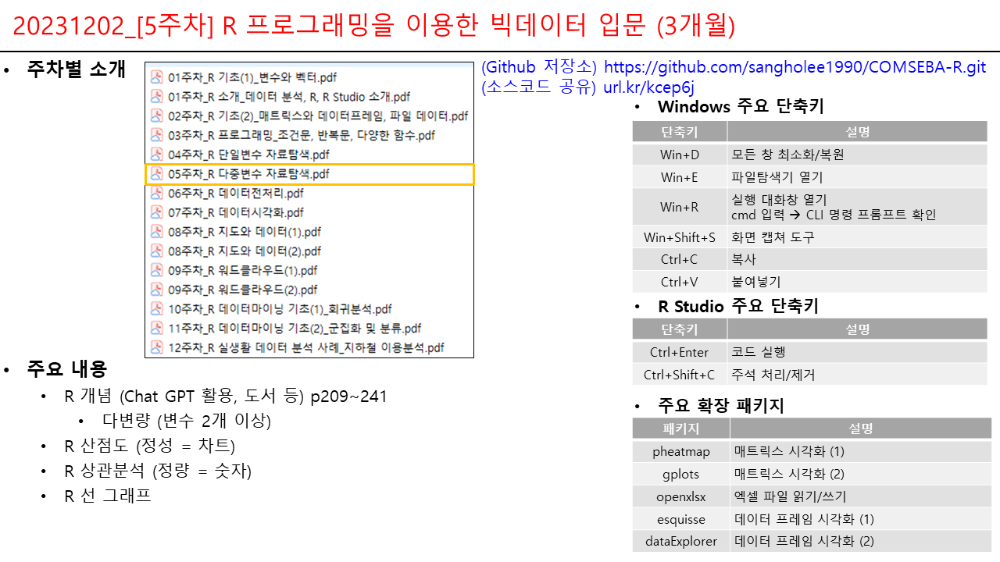

# COMSEBA-R

[컴세바] R 프로그래밍을 이용한 빅데이터 입문 (3개월)

-   업무명 : 주차별 계획 및 오프라인 강의안
-   작성자 : 이상호
-   작성일 : 2023.11.04
-   수정이력 :
    -   2023.11.04 : 초안
    -   2023.11.05 : 1주차
    -   2023.11.11 : 2주차
    -   2023.11.18 : 3주차
    -   2023.11.25 : 4주차
    -   2023.12.02 : 5주차
-   최종 결과물
    -   이론/실습에 대한 Github 형상관리
    -   산출물 관리 (연구노트/작품)
    -   Git, Github 소스코드 형상관리: 원격 저장소 연결/업로드/다운로드
    -   GFS 구글 파일 시스템 문서/데이터 형상관리: 연결/업로드/다운로드
    -   티스토리/네이버 계정 연결, 블로그 포스팅
-   주차별 계획

+-------------+-----------------------------------------+--------------------------------------------------------------+
| 구분        | 이론 (30분)                             | 실습 (1시 10분)                                              |
+:===========:+=========================================+==============================================================+
| 1주차       | -   주차별 소개                         | -   R 4.3.2, R Studio 2013.09, R Tools 4.3 다운로드/설치     |
|             |                                         |                                                              |
|             | -   인터넷 검색, Chat GPT 활용 방안     | -   작업환경 생성/관리 (C:/SYSTEMS/PROG/R/COMSEBA-R)         |
|             |                                         |                                                              |
|             | -   결과물 관리 방안 (Git, GitHub 소개) | -   Hello World 출력                                         |
|             |                                         |                                                              |
|             | -   데이터 소개                         | -   기본 연산, 변수, 벡터의 이해, 벡터의 연산, 리스트와 벡터 |
|             |                                         |                                                              |
|             | -   R, R Studio 소개                    |                                                              |
|             |                                         |                                                              |
|             | -   변수와 벡터                         |                                                              |
+-------------+-----------------------------------------+--------------------------------------------------------------+
| 2주차       | -   패키지 설치/읽기                    | -   매트릭스와 데이터프레임 소개                             |
|             |                                         |                                                              |
|             | -   매트릭스와 데이터프레임             | -   파일 데이터 읽기/쓰기                                    |
|             |                                         |                                                              |
|             | -   파일 데이터                         |                                                              |
+-------------+-----------------------------------------+--------------------------------------------------------------+
| 3주차       | -   조건문, 반복문                      | -   if 조건문, 다중조건문                                    |
|             |                                         |                                                              |
|             | -   다양한 함수                         | -   for/while 반복문, 벡터화                                 |
|             |                                         |                                                              |
|             |                                         | -   apply 기본 함수                                          |
|             |                                         |                                                              |
|             |                                         | -   사용자 함수                                              |
+-------------+-----------------------------------------+--------------------------------------------------------------+
| 4주차       | -   단일변수 자료탐색                   | -   자료 종류                                                |
|             |                                         |                                                              |
|             |                                         | -   범주형 자료 (명목형, 순서형)                             |
|             |                                         |                                                              |
|             |                                         | -   연속형 자료                                              |
+-------------+-----------------------------------------+--------------------------------------------------------------+
| 5주차       | -   다중변수 자료탐색                   | -   산점도 (정성 = 차트)                                     |
|             |                                         |                                                              |
|             |                                         | -   상관분석 (정량 = 숫자)                                   |
|             |                                         |                                                              |
|             |                                         | -   선 그래프                                                |
+-------------+-----------------------------------------+--------------------------------------------------------------+
| 6주차       | -   데이터 전처리                       | -   결측값, 특이값                                           |
|             |                                         |                                                              |
|             |                                         | -   데이터 정렬, 분할, 샘플링                                |
|             |                                         |                                                              |
|             |                                         | -   데이터 집계, 병합                                        |
+-------------+-----------------------------------------+--------------------------------------------------------------+
| 7주차       | -   데이터 시각화                       | -   기본 함수 시각화                                         |
|             |                                         |                                                              |
|             |                                         | -   ggplot 시각화                                            |
+-------------+-----------------------------------------+--------------------------------------------------------------+
| 8주차       | -   지도와 데이터                       | -   구글맵 이용방법                                          |
|             |                                         |                                                              |
|             |                                         | -   특정 지역/위경도의 지도 보기                             |
|             |                                         |                                                              |
|             |                                         | -   지도 기반 마커/텍스트/데이터 표시                        |
+-------------+-----------------------------------------+--------------------------------------------------------------+
| 9주차       | -   워드클라우드                        | -   텍스트 파일 읽기                                         |
|             |                                         |                                                              |
|             |                                         | -   한글 명사 추출                                           |
|             |                                         |                                                              |
|             |                                         | -   빈도수, 워드클라우드 시각화                              |
+-------------+-----------------------------------------+--------------------------------------------------------------+
| 10주차      | -   회귀분석                            | -   단순/다중선형 회귀분석                                   |
|             |                                         |                                                              |
|             |                                         | -   로지스틱 회귀분석                                        |
+-------------+-----------------------------------------+--------------------------------------------------------------+
| 11주차      | -   군집화 및 분류                      | -   K 평균 군집화                                            |
|             |                                         |                                                              |
|             |                                         | -   K 최근접 이웃 분류                                       |
+-------------+-----------------------------------------+--------------------------------------------------------------+
| 12주차      | -   실생활 데이터 분석 사례             | -   서울특별시 상가업소 데이터 탐색                          |
|             |                                         |                                                              |
|             |                                         | -   업종별 시각화                                            |
|             |                                         |                                                              |
|             |                                         | -   지도기반 업종별 시각화                                   |
+-------------+-----------------------------------------+--------------------------------------------------------------+

-   오프라인 강의안

      
